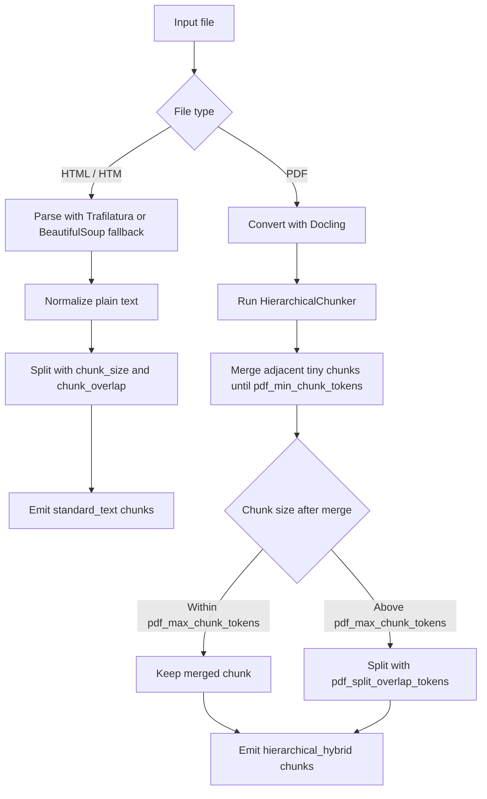

# MyRAG Implementation Documentation

## 1. Overview

MyRAG is a modular, research-oriented Retrieval-Augmented Generation (RAG) pipeline. Its primary goal is to provide a transparent, debuggable, and extensible system for transforming unstructured documents (PDFs, HTML) into a high-precision QA system.

Unlike "black-box" RAG frameworks, MyRAG prioritizes **explainability**, allowing researchers to trace exactly which chunks were retrieved and why, and evaluate the quality of each stage using industry-standard metrics.

---

## 2. Technical Stack

### A. Document Parsing & Chunking

To ensure high-quality text extraction and structural preservation, we use a sophisticated ingestion strategy:

- **Parsing**:
  - **PDF**: `Docling` (by IBM). Docling identifies layout structures such as tables and headers, then outputs a strictly typed `DoclingDocument`.
  - **HTML**: `Trafilatura` with a BeautifulSoup fallback. HTML pages are treated as web text because many scraped pages convert successfully in Docling but produce no chunkable structure.
- **Chunking**:
  - PDFs use `docling.chunking.HierarchicalChunker` followed by hybrid normalization.
  - HTML uses the standard overlapping text chunker controlled by `ingestion.chunk_size` and `ingestion.chunk_overlap`.
  - PDF `ChunkRecord`s can include Docling metadata such as page numbers. HTML `ChunkRecord`s keep external crawl metadata such as `source_url`, `domain`, and `scraped_at`.
  - **Job-Level Snapshots**: For debugging, normal ingestion can save one JSON snapshot per ingestion job to `storage/snapshots/ingest_job_<timestamp>.json`. This is controlled by `ingestion.save_snapshots` in the config. Processed files include their actual chunk text in the snapshot; unchanged and duplicate files are represented as manifest entries for efficiency.
  - **Network Configuration**: To bypass host firewall (UFW) blockers that often drop packets from the Docker bridge to the host IP, we use `network_mode: host`. This removes Docker-network isolation for this container and allows it to talk to `localhost:11434` (Ollama) and `localhost:19530` (Milvus) with zero firewall interference.

### B. Embedding & Vector Storage

We implement a **Hybrid Retrieval** strategy using a **Dual-Routing** architecture to maximize both accuracy and speed.

#### 1. Dense Strategy: `microsoft/harrier-oss-v1-0.6b`

A decoder-only multilingual embedding model (Qwen-based) using last-token pooling.

- **Ingestion Path**: Documents are embedded plainly using `embed_documents()` - no instruction prompt.
- **Query Path**: Queries use `embed_query()` which automatically applies the `web_search_query` instruction prompt. This alignment is critical: the model was trained to identify relevant passages specifically when prompted with a task instruction.

#### 2. Sparse Strategy: `opensearch-project/opensearch-neural-sparse-encoding-doc-v3-gte`

An **Asymmetric, Inference-Free** learned sparse retriever.

- **Ingestion Path**: Uses the **Full Neural Model** (`model.encode_documents`) to expand documents with latent terms and importance weights.
- **Query Path**: Uses the **Inference-Free Path** (`model.encode_queries`). It utilizes a pre-computed Tokenizer + IDF weight lookup table. This removes the need for a GPU forward pass during search, resulting in near-zero query latency for sparse retrieval.

### C. Retrieval Fusion: Reciprocal Rank Fusion (RRF)

After both searches return their top-k candidates, we fuse them using **Custom RRF**:

```
score(d) = sum(1 / (k + rank_i))
```

- `k = 60` (the standard constant from the original RRF paper).
- Dense and sparse rank lists are merged - documents appearing in both lists get a higher combined score.
- The result is a single sorted candidate pool (typically top-50) passed to the reranker.

### D. Reranking

For late-stage precision, we use a **Listwise Cross-Encoder Reranker**:

- **Model**: `jinaai/jina-reranker-v3-GGUF:Q5_K_M` served through llama.cpp. This keeps the reranker on-GPU while cutting VRAM compared with the full FP32 transformer path.
- **Process**: The retriever fetches a wide candidate pool (Top-50). The reranker performs a deep pairwise comparison between the query and each candidate, re-sorting them by semantic relevance.
- **Top-K Slicing**: After reranking, only the top `rerank_top_k` documents (default: 5) are passed to the LLM. This prevents token-window overflow while ensuring the LLM receives the highest-quality context.
- **Why this is the memory hotspot**: the reranker is listwise and long-context. VRAM usage is dominated by the total query + chunk tokens, attention buffers, and activations, not just the 0.6B parameter count. On GTX 1080-class GPUs, the current FP32 transformer path can easily reach multi-GB usage per query.
- **What changed**: dense/sparse embeddings are loaded once and kept resident. The reranker is no longer loaded in-process; it is a dedicated llama.cpp service over HTTP.

### E. Generation

- **LLM**: Local models served via **vLLM** or **Ollama** (accessed via OpenAI-compatible API).
- **Grounding & Attribution**:
  - The system uses a strict system prompt that forces the LLM to rely ONLY on the provided context.
  - Each chunk is prepended with source URLs and scrape date: `Source [pdf_url | page_url (Scraped: date)]: Text`.
  - The system returns public source objects with `pdf_url`, `page_url`, `scraped_at`, `page`, and `pages`. PDF sources are grouped by PDF URL plus page number, and `pages` is kept empty for now. Non-PDF sources use `page_url`; if only scraped `source_url` exists, it is exposed as `page_url`.
  - `<think>...</think>` tags from reasoning models (e.g., Qwen, DeepSeek) are automatically stripped.
- **Confidence Scoring**:
  - The confidence score is retrieval-strength only, derived from retrieval ranking evidence (`0.0` to `1.0`).
  - The score uses top-5 RRF strengths. Each is normalized by the theoretical max fused RRF score for this pipeline (`dense + sparse`, `k=60`): `2/(60+1)`, then averaged.
  - This score is deterministic and does not trigger a second LLM confidence-check call.
  - Interpret it as evidence strength, not as a factual correctness probability.
- **Reasoning Model Handling**:
  - Reasoning models may emit `<think>...</think>` blocks.
  - The API strips those blocks from the visible answer before returning it to the client.
  - This keeps internal reasoning hidden while preserving the final answer text.

### F. Incremental Ingestion, Deduplication & State Management

To avoid redundant processing and ensure index integrity, the system implements **Incremental Ingestion**:

- **Content Change Detection**: Every candidate file is fingerprinted using **SHA-256** before parsing. Older MD5 state entries are still tolerated during state loading so existing deployments can transition without manually deleting `storage/ingestion_state.json`.
- **State Registry**: A JSON file (`storage/ingestion_state.json`) tracks each known file path, content hash, document ID, chunk count, and metadata.
- **Stable Document IDs**: New canonical documents use a stable hash-derived ID such as `doc_<hash12>`, so the same content keeps the same identity across ingestion runs.
- **Deduplication**:
    - **UNCHANGED**: If the same path has the same content hash, the file is skipped without parsing, chunking, embedding, or Milvus writes.
    - **MODIFIED**: If the same path has changed content, the system embeds the replacement chunks, then performs `delete_by_source` in Milvus before inserting the new records.
    - **DUPLICATE**: If a different path has byte-for-byte identical content to an existing canonical file, the file is skipped and recorded as an alias of the canonical document. This avoids duplicate vectors even when filenames change.
- **Job Snapshot Manifest**: When `save_snapshots` is enabled, each ingestion call writes one snapshot containing run metadata, per-file status, totals, and chunks for newly processed files only. Skipped unchanged and duplicate files do not include fresh chunks because they are not rechunked.
- **File Uploads**: A dedicated directory (`/app/uploads`) is mounted to the container to handle documents uploaded via the API, which are then queued for immediate ingestion.

### G. Streaming Generation

For a responsive user experience, the system supports real-time token streaming:

- **Protocol**: Server-Sent Events (SSE).
- **Format**:
    - **Type: `metadata`**: The first message contains the query and number of retrieved docs.
    - **Type: `context`**: The second message contains the formatted retrieved context sent to the LLM.
    - **Type: `sources`**: The third message contains the deduplicated public source list.
    - **Type: `token`**: Subsequent messages contain individual text tokens as they are emitted by the LLM.
    - **Type: `confidence`**: The final message contains retrieval-strength confidence derived from ranked evidence.
    - **Type: `timings`**: The final timing payload contains retrieval, generation, and end-to-end duration fields.
- **Context exposure**: The stream emits the formatted retrieved context before answer tokens, so clients and evaluation jobs can capture context without falling back to non-streaming `/query`.
- **Implementation**: The pipeline uses the `stream=True` parameter in the OpenAI-compatible client, yielding chunks directly to the FastAPI `StreamingResponse`.

### H. Evaluation & Observability

- **Framework**: `RAGAS`.
- **Metrics**: Faithfulness, Answer Relevance, Context Precision, and Context Recall.
- **Failure Categorization**: The evaluator automatically categorizes failures into:
  - **Retrieval Failure**: Relevant info was not in the top-50.
  - **Reranking Failure**: Relevant info was in top-50 but ranked too low.
  - **Generation Failure**: Correct context was present, but the LLM failed to use it.
- **Synthetic QA**: A module that uses the LLM to generate "Ground Truth" Q&A pairs from your documents.
- **Canonical Guide**: Evaluation workflow, metric semantics, config examples, artifact layout, and reasoning toggles now live in `EVALUATION_GUIDE.md`.
- **Live Prompt Source**: The actual evaluation prompt logic is not stored in this repo. It comes from the installed `ragas` library, and `EVALUATION_GUIDE.md` points to the live package files used at runtime.
- **Artifact Layout**: Eval artifacts now group under `storage/eval_runs/<run_name>/` with `run_manifest.json`, `predictions/`, `scores/`, and `logs/`.
- **Current Iteration Dataset**: The default benchmark is `storage/eval_datasets/main/ui_main_v3.json`, a 50-row user-like benchmark manually reviewed against the local `/data` corpus. `storage/eval_datasets/main/ui_main_v2.json` remains available as a controlled chunk-grounded benchmark for technical comparison. The lighter legacy seed set is kept at `storage/eval_datasets/seeds/ui_seed_v1.json`, and refusal/out-of-scope checks stay separate at `storage/eval_datasets/diagnostics/ui_refusal_v1.json`.

---

## 3. The Dual-Routing Map


## 4. Pipeline Data Flow

### Ingestion Flow
`Configured Scraper / Uploaded Files / Existing Data` -> `Raw Files` -> `SHA-256 Fingerprint Scan` -> `Incremental/Duplicate Classification` -> `PDF: Docling + Hierarchical Hybrid Chunking / HTML: Trafilatura + Standard Text Chunking` -> `Dense & Sparse Embedding` -> `Milvus Storage` -> `Job Snapshot Manifest`

### Query Flow
`User Query` -> `Dual Embedding` -> `Milvus Hybrid Search` -> `Metadata Filtering (Optional)` -> `RRF (k=60)` -> `Top-50 Candidates` -> `Jina Reranking` -> `Top-5 Context` -> `Grounded Generation` -> `Answer + Sources`

---

## 5. Configuration Reference

All configuration is driven by `config_rag.yaml` (local) or `config_server.yaml` (Docker server).

### Key Parameters

| Section | Parameter | Default | Description |
|---|---|---|---|
| `ingestion` | `chunk_size` | `1024` | Max token-like units per standard HTML text chunk |
| `ingestion` | `chunk_overlap` | `120` | Overlap for standard HTML text chunks |
| `ingestion` | `pdf_min_chunk_tokens` | `256` | Minimum token-like size for merged PDF hierarchical chunks |
| `ingestion` | `pdf_max_chunk_tokens` | `1024` | Upper bound before a PDF hierarchical chunk is split |
| `ingestion` | `pdf_split_overlap_tokens` | `120` | Overlap used only when splitting oversized PDF hierarchical chunks |
| `ingestion` | `pdf_parser` | `docling` | Parser for PDF files |
| `ingestion` | `pdf_chunking_strategy` | `hierarchical` | Chunking strategy for PDF files; uses Docling `HierarchicalChunker` plus hybrid normalization |
| `ingestion` | `html_parser` | `trafilatura` | Parser for HTML files |
| `ingestion` | `html_chunking_strategy` | `standard` | Chunking strategy for HTML files; standard uses `chunk_size` and `chunk_overlap` |
| `embedding` | `device` | `cuda:0` | Default GPU for embedding models |
| `embedding` | `dense_device` | `cuda:0` | Explicit GPU for Dense model |
| `embedding` | `sparse_device` | `cpu` | Device for Sparse query encoding |
| `retrieval` | `reranker_endpoint` | `http://127.0.0.1:8012/v1/rerank` | llama.cpp reranking endpoint |
| `retrieval` | `k` | `50` | Candidate pool size fetched from Milvus |
| `retrieval` | `rerank_top_k` | `5` | Docs passed to the LLM after reranking |
| `retrieval` | `reranker_model` | `jinaai/jina-reranker-v3-GGUF:Q5_K_M` | Reranker model name/path used by llama.cpp |
| `generation` | `llm_endpoint` | `http://localhost:8000/v1` | OpenAI-compatible LLM endpoint |
| `generation` | `model_name` | `llama-3-8b` | Model served by vLLM/Ollama |

---

## 6. API Reference

The service exposes a FastAPI application on port `8000`.

### `GET /health`
Verifies pipeline and vector database connectivity.
```json
{"status": "healthy", "milvus": "connected"}
```

### `GET /collections`
Lists all indexed collections in the vector store. Useful for debugging.
```json
{"collections": ["documents"]}
```

### `POST /query`
The primary endpoint for retrieving context and generating answers.
- **Request Body**:
  ```json
  {
    "query": "Apa itu mekanisme penelaahan usulan pembukaan program studi?",
    "metadata_filter": {"doc_id": "sk_rektor_001"},
    "config_override": {}
  }
  ```
- **Response**: Returns the answer, combined context, and a public source array. Each source contains `pdf_url`, `page_url`, `scraped_at`, `page`, and `pages`; PDF sources are grouped by PDF URL plus page number, `pages` is currently empty, and HTML/non-PDF sources have `pdf_url: null`, `page: null`, and `pages: []`.

### `POST /query/stream`
Streaming version of the RAG query. Returns tokens as they are generated.
- **Request Body**: Same as `/query`.
- **Response**: SSE stream of JSON objects:
  ```json
  {"type": "metadata", "content": {"num_docs": 5, "query": "..."}}
  {"type": "context", "content": "Source [...]..."}
  {"type": "sources", "content": [...]}
  {"type": "token", "content": "Hello"}
  {"type": "confidence", "content": {"confidence_score": 0.82, "query": "..."}}
  {"type": "timings", "content": {"retrieval_time_ms": 100.0, "generation_time_ms": 500.0, "end_to_end_time_ms": 650.0}}
  ```
  The stream emits context before answer tokens. The `sources` event uses the same public source builder as `/query`, including non-PDF fallback from `source_url` to public `page_url`.

### Scraper API
The scraper API refreshes source files under `/app/data` and deliberately does not trigger ingestion automatically. Use it to refresh the raw corpus, then run `/ingest` for incremental updates or the CLI rebuild workflow when you need a fresh state file and shadow collection.

**Configured domains**:
- `simak.ui.ac.id`
- `www.ui.ac.id`
- `kemahasiswaan.ui.ac.id`
- `beasiswa.ui.ac.id`
- `penerimaan.ui.ac.id`
- `international.ui.ac.id`
- `admission.ui.ac.id`

`enrollment.ui.ac.id` is excluded from the configured scrape set because the currently reachable page returns an authentication/loading shell instead of usable public content. Remove any stale `data/enrollment` folder before rebuilding the index.

**`GET /scraper/sites`** - list configured domains, seeds, allowed paths, disallowed paths, rate limit, depth, and parallelism.

**`POST /scraper/jobs/configured-site`** - start a scrape by matching the request URL's domain against the built-in configured sites.

```json
{"site_url": "https://simak.ui.ac.id/", "dry_run": true}
```

**`POST /scraper/jobs/urls`** - start a scrape from explicit URLs on one domain. Non-UI domains are blocked unless `allow_external` is set to `true`.

```json
{
  "urls": [
    "https://simak.ui.ac.id/jadwal-seleksi/",
    "https://simak.ui.ac.id/sk-biaya-pendidikan-ui/"
  ],
  "dry_run": true
}
```

**`GET /scraper/jobs/{job_id}`** - view scrape status, counts, current URL, output path, and errors.

**`POST /scraper/jobs/{job_id}/cancel`** - request cancellation.

The scraper writes `page.html` plus `page.meta.json` for HTML pages, and stores PDFs beside the referring page with `<filename>.pdf.meta.json`. The sidecars preserve source URL, domain, scraped time, status code, content type, and PDF-specific fields such as `pdf_url`, `page_url`, and `filename`.
During ingestion, HTML `source_url` and PDF `pdf_url`/`page_url` are preserved in chunk metadata. Query and stream responses expose HTML `source_url` as public `page_url` when no explicit `page_url` exists.
Configured `disallowed_paths` are also used as noise control, so selected low-signal pages/PDFs are intentionally skipped during scraping to keep retrieval quality focused.

The current refreshed corpus contains 99 HTML files, 49 PDFs, and 148 metadata JSON files. Scraping and ingestion remain separate: once the corpus looks sane, use the rebuild workflow below to create a fresh shadow collection.

### `POST /ingest`
Triggers a background ingestion process for a directory.
- **Request Body**:
  ```json
  {"directory_path": "/app/data"}
  ```
- **Response**: `{"status": "ingestion_started", "directory": "/app/data"}`
- **Incremental Logic**: If `ingestion.incremental` is true, it only processes new/modified canonical files. Unchanged files are skipped, and duplicate-content files are recorded as aliases without embedding duplicate vectors.
- **Snapshots**: If `ingestion.save_snapshots` is true, the run writes one `storage/snapshots/ingest_job_<timestamp>.json` file. Processed entries include actual chunk text; unchanged and duplicate entries are manifest-only.

### CLI safe rebuild
When ingestion logic changes but the source file bytes are unchanged, a normal `/ingest` may skip files because the existing state file still marks them as unchanged. Use the CLI rebuild workflow instead of wiping Milvus:

```bash
python cli.py rebuild-index --config config_rag.yaml --directory ./data
```

This creates a generated rebuild config, a fresh ingestion state file, and a shadow collection such as `documents_rebuild_YYYYMMDD_HHMMSS`. After validation, use:

```bash
python cli.py promote-index \
  --rebuild-dir storage/rebuilds/YYYYMMDD_HHMMSS
```

The promotion command prints the exact production config values to apply; it does not mutate production config automatically. In the Docker server deployment, the detached rebuild path should use `docker exec -d my-rag-api ...` rather than `docker compose run -d ...` because this repo uses `network_mode: host` for `rag-api`.

Before running the rebuild, confirm that stale scrape folders are not present in `/app/data`. For the current UI scrape set, `data/enrollment` should stay absent unless that site later exposes crawlable public pages.

After the rebuilt collection is promoted and any old collection is cleaned up, you may also delete the old rebuild bundle folder itself. On Docker servers, files under bind-mounted `storage/` may be root-owned, so if host-side deletion fails with `permission denied`, remove the folder from inside the running API container:

```bash
docker exec -it my-rag-api sh
rm -rf /app/storage/rebuilds/YYYYMMDD_HHMMSS
```

### `POST /ingestion/upload`
Uploads a single file (PDF/HTML) and triggers ingestion.
- **Multipart Form**: `file` (the document to upload).
- **Processing**: Saves to `/app/uploads` and runs the incremental ingestion loop.

### `GET /ingestion/status`
Returns a dashboard of all currently ingested files.
- **Response**: List of file paths, content hashes, document IDs, chunk counts, and alias metadata for duplicate files.


### Interactive Docs
Visit `http://<SERVER_IP>:8000/docs` for the full Swagger UI.

### Debug Endpoints
The system includes several debugging endpoints to inspect the pipeline at different stages:

**`POST /debug/chunks`** - View chunks after chunking but before embedding
- Request body: `{"directory_path": "/app/data", "save_to_file": true, "output_format": "json"}`
- Response: Array of chunk objects with detailed metadata (text, doc_id, breadcrumb, page_number, etc.)

**`POST /debug/retrieve`** - View retrieval results after RRF fusion but before reranking
- Request body: `{"query": "your query", "k": 20, "metadata_filter": {}}`
- Response: Retrieved documents with RRF scores

**`POST /debug/rerank`** - View reranking results after Jina reranking but before LLM generation
- Request body: `{"query": "your query", "k": 20, "rerank_top_k": 5}`
- Response: Reranked documents with updated scores

## Chunking Decision Tree

### End-to-End Path



### How PDF Max Splitting Works

- The split is a size guardrail, not a new semantic parser.
- If a merged PDF chunk grows beyond `pdf_max_chunk_tokens`, it is split by token-like units with `pdf_split_overlap_tokens`.
- The overlap softens the boundary so the next chunk still carries some trailing context from the previous one.
- The current PDF normalization range is `256-1024` token-like units, with `120` token-like units of overlap only when oversized PDF chunks must be split.
- This does mean a long table or long appendix can still be cut across a boundary, but it avoids a single giant retrieval unit that becomes hard to rank and expensive to embed/rerank.

### Why This Decision Tree Exists

- HTML pages usually behave like web text, so standard overlap chunking works well.
- PDF chunks benefit from structural chunking first, then a simple merge-small / split-large normalization pass.
- This keeps the policy understandable and general, even though it cannot be optimal for every flattened table scenario.

## 7. CLI Usage (Extended)

### 7.7 Debugging Commands

**`python cli.py inspect-chunks`** - Inspect chunks before embedding
```bash
python cli.py inspect-chunks --config config_rag.yaml --directory ./data --show-stats
```
Options:
- `--output-file`: Save chunks to a file
- `--show-stats`: Show chunking statistics
- `--filter-keyword`: Filter chunks containing specific keyword

**`python cli.py debug-query`** - Debug query with full pipeline inspection
```bash
python cli.py debug-query --config config_rag.yaml --query "Your query" --show-stages --output-format detailed
```
Options:
- `--show-stages`: Show results at each pipeline stage
- `--output-format`: Output format (json, text, detailed)

These commands allow you to inspect the intermediate results of the RAG pipeline without triggering the LLM generation.
---

## 7. CLI Usage

### 7.1 Ingesting Data
```bash
python cli.py ingest --config config_rag.yaml --directory ./my_docs
```

### 7.2 Standard QA
```bash
python cli.py query --config config_rag.yaml --query "What is the result of the study?"
```

### 7.3 Document-Specific Search
```bash
python cli.py query --config config_rag.yaml --query "..." --doc-ids doc_001 doc_005
```

### 7.4 Keyword Debugging
```bash
# Find all chunks containing a word
python cli.py find-keyword --config config_rag.yaml --keyword "neural network"

# Trace if a specific query's results contained a required keyword
python cli.py trace --config config_rag.yaml --query "..." --check-keyword "activation"
```

### 7.5 Evaluation

Use `EVALUATION_GUIDE.md` as the canonical evaluation document.

Common commands:

```bash
sh /app/scripts/eval_run.sh evaluation/configs/base/qwen36_judge.yaml
python cli.py eval-generate --config config_rag.yaml --model qwen3.5:4b --label qwen35_4b
python cli.py eval-score --config evaluation/configs/profiles/generation.yaml --predictions storage/eval_runs/<run_name>/predictions/<file>.json
python cli.py eval --config evaluation/configs/matrices/generation_rerank5.yaml
```

The guide documents:

- what each RAGAS metric means
- where the live prompt logic actually comes from
- how the run manifest and structured eval folders work
- that the recommended generation matrix uses `retrieval.rerank_top_k: 5` via `evaluation/configs/matrices/generation_rerank5.yaml`
- that score-only reports measure whole-job scoring runtime in `total_runtime_ms` and `total_runtime_seconds`
- how reasoning toggles work for local generation and qwen3.6:27b judging

---

## 8. Extensibility Guide

### Adding a New Parser
1. Create a class inheriting from `BaseParser` in `ingestion/`.
2. Implement `extract()` and `accepts_extension()`.
3. Register it in `IngestionPipeline.process_file()`.

### Changing the Embedding Model
1. Update `embedding.dense_model` or `embedding.sparse_model` in `config_rag.yaml`.
2. Re-run the `ingest` command to rebuild the Milvus index.

### Adding New Evaluation Metrics
1. Add the metric class from `ragas.metrics` to the `metric_map` in `evaluation/evaluator.py`.
2. Add the metric name to the `metrics` list in `config_rag.yaml`.
3. Re-check `EVALUATION_GUIDE.md` so the evaluation contract stays aligned with the actual implementation.

---

## 9. Stability & Performance Tuning (Lessons Learned)

The following optimizations were implemented to stabilize the pipeline for production use on the research server.

### A. The "Silent" OCR Failure (`libGL.so.1`)
- **Problem**: In `python:slim` images, OCR engines like `easyocr` or `rapidocr` fail to import because `opencv-python` looks for graphical libraries (`libGL.so.1`) that don't exist in lean containers.
- **Fix**: Used `opencv-python-headless`. This version is optimized for server environments and removes all GUI/OpenGL dependencies.
- **Engine Preference**: `rapidocr-onnxruntime` is used as a lightweight CPU/GPU fallback, while `easyocr` is preferred for native PyTorch/CUDA acceleration on the GTX 1080.

### B. PyMilvus 2.5.0 API Migration
- **Problem**: Upgrading to Milvus 2.5.0 (to fix legacy `pkg_resources` bugs) introduced breaking keyword changes in the Python SDK.
- **Fixes**:
  - Renamed `param` to `search_params` in `MilvusClient.search()`.
  - Renamed `expr` to `filter` for metadata filtering.
  - Removed `setuptools` version pinning as PyMilvus 2.5+ no longer requires the deprecated `pkg_resources` module.

### C. CUDA Out-of-Memory (OOM) Management
- **Problem**: The SPLADE sparse embedding model (`opensearch-v3-gte`) has a 30,522-dimension output. Batch sizes of 32 exceed the 8GB VRAM limit of the GTX 1080 when running dual-models (Harrier + SPLADE).
- **Fix**: Reduced `embedding.batch_size` to `16` (or `4` for maximum safety). This reduces the activation matrix memory pressure during the SpladePooling stage.

| **Issue** | **Root Cause** | **Resolution** |
|---|---|---|
| `CUDA out of memory` during ingestion | SPLADE model vocabulary expansion (30k dims) is too large for batch size 32 | Lower `batch_size` to `16` or `4` in `config_server.yaml` |
| **Increased Query Latency** | Model reload churn to save VRAM | This is no longer used. Dense/sparse embeddings stay loaded, and the reranker is a separate service. |

### D. GPU Memory Competition Issue
- **Problem**: When running the RAG system in Docker with GPU access, the reranker alone can consume most of GPU 1. In older deployments, Ollama could also compete for VRAM, but the reranker is the stage that explains the 7 GB spike you observed.
- **Solution**:
  1. **GPU Isolation**: Assign separate GPUs for embedding/reranking vs LLM inference in docker-compose.yml:
     - GPU 0: Embedding models (Harrier, OpenSearch sparse)
     - GPU 1: Dedicated GGUF reranker service
  2. **Memory Management**: Keep embeddings resident; remove unload/reload churn
  3. **Environment Variable**: Set PYTORCH_CUDA_ALLOC_CONF=expandable_segments:True only if you still see fragmentation in other GPU workloads

### F. Persistent Models
- **Mechanism**: Dense and sparse embedding models are loaded at startup and stay resident for the lifetime of the process.
- **Latency Impact**: Query latency is lower because there is no unload/reload churn between requests.
- **Optimization**: The reranker is the only remaining memory-sensitive stage; run it as a dedicated GGUF service.

- **Fix**: PDFs are parsed through Docling for structure and table handling. HTML is parsed through Trafilatura/BeautifulSoup and chunked as plain web text to avoid Docling HTML conversions that produce no chunkable document items.

### G. Multi-GPU Distribution Strategy
To support 8GB VRAM cards alongside a local LLM, the system implements **Spatial Deconfliction**:
- **GPU 0**: Dedicated to Dense Embedding (Harrier).
- **GPU 1**: Dedicated to the GGUF reranker service.
- **CPU Offloading**: Sparse query encoding is forced to CPU to save VRAM for the dense reranking pass.
- **Explicit Cleanup**: There is no embedding unload path anymore.

---

## 10. Future Roadmap & Planned Features

### Semantic FAQ Router (Intent Routing / Guardrails)
To improve performance, reduce LLM costs, and ensure 100% accuracy for strictly administrative queries (e.g., "lost ID card", "leave of absence steps"), an **Intent Router** is planned to bypass the LLM entirely for high-confidence queries.

#### Architecture Proposal:
1. **FAQ Vector Collection**: A new `faq_collection` in Milvus storing anticipated questions (embedded using `Harrier`) alongside their verified, hardcoded markdown answers in metadata.
2. **Pre-Retrieval Interception**:
   - The user's query is embedded.
   - We perform a cosine similarity search against `faq_collection`.
   - **Threshold Match (> 0.90)**: The semantic router SHORT-CIRCUITS the pipeline. The verified answer is returned instantly (~0.1s latency). No chunks are fetched, Jina is not invoked, and the generation LLM is completely bypassed.
   - **Fallback (< 0.90)**: The query proceeds through the normal Dual-Routing architecture (Dense + Sparse -> RRF -> Reranker -> LLM).
3. **Automated Bootstrapping**: Using curated evaluation datasets and human review before inserting anticipated Q&A pairs into the `faq_collection`.

---

## 11. Known Issues & Configuration Discrepancies

As of April 2026, there are several areas where ingestion and model limits still need care:

### A. Chunker Configuration (`chunk_size`, `chunk_overlap`, and PDF hybrid knobs)
- **Current Behavior**: HTML uses the standard overlapping chunker controlled by `chunk_size` and `chunk_overlap`.
- **Current Behavior**: PDFs use Docling `HierarchicalChunker`, then merge undersized chunks up to `pdf_min_chunk_tokens`.
- **Current Behavior**: Any merged PDF chunk above `pdf_max_chunk_tokens` is split with `pdf_split_overlap_tokens`.
- **Current Defaults**: HTML uses `chunk_size: 1024` and `chunk_overlap: 120`; PDF normalization uses `pdf_min_chunk_tokens: 256`, `pdf_max_chunk_tokens: 1024`, and `pdf_split_overlap_tokens: 120`.
- **Why 1024**: We moved from 512 to 1024 because 512-sized chunks were cutting off important document context in practice.
- **Impact**: PDF chunking keeps structural boundaries where possible, avoids tiny chunks, and uses overlap to soften large-chunk boundaries without adding document-specific heuristics.

### B. Embedding Model Context Limits
- **Issue**: Most embedding models (Dense and Sparse) have internal token limits (typically 512 or 8192). 
- **Impact**: If you manually set a very large `chunk_size` (e.g., 8,000) that the embedding model cannot handle, the model will truncate the text before generating the vector. This means the "middle" and "end" of your 8,000-token chunk will not be searchable.
- **Verification**: Always cross-reference your `chunk_size` with the `max_seq_length` of your dense/sparse models.

### C. Reranker Context vs. Server Context
- **Issue**: The reranker model supports 8,192 tokens, but the `llama.cpp` server defaults to a smaller context window if not explicitly overridden. 
- **Impact**: Even if your chunks are 8k tokens, the reranker might only "see" the first 512 of them.
- **Fix**: The `-c 8192` flag in `docker-compose.yml` addresses this.

### D. Ingestion Failure Isolation
- **Current Behavior**: Ingestion is file-scoped. Each file is parsed, embedded, inserted, and marked successful independently.
- **Retry Behavior**: Dense and sparse embedding batches retry with smaller batch sizes after failures such as CUDA OOM. If one file still fails, the run logs that file as failed and continues with the remaining files.
- **Summary Logs**: Each run logs indexed chunks, successful files, failed files, skipped unchanged files, and per-file failure details.

